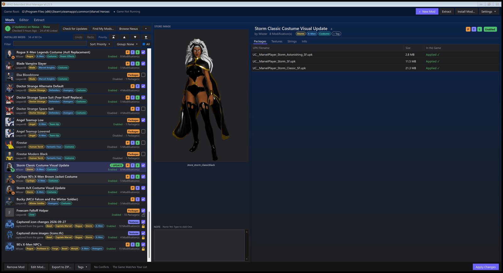
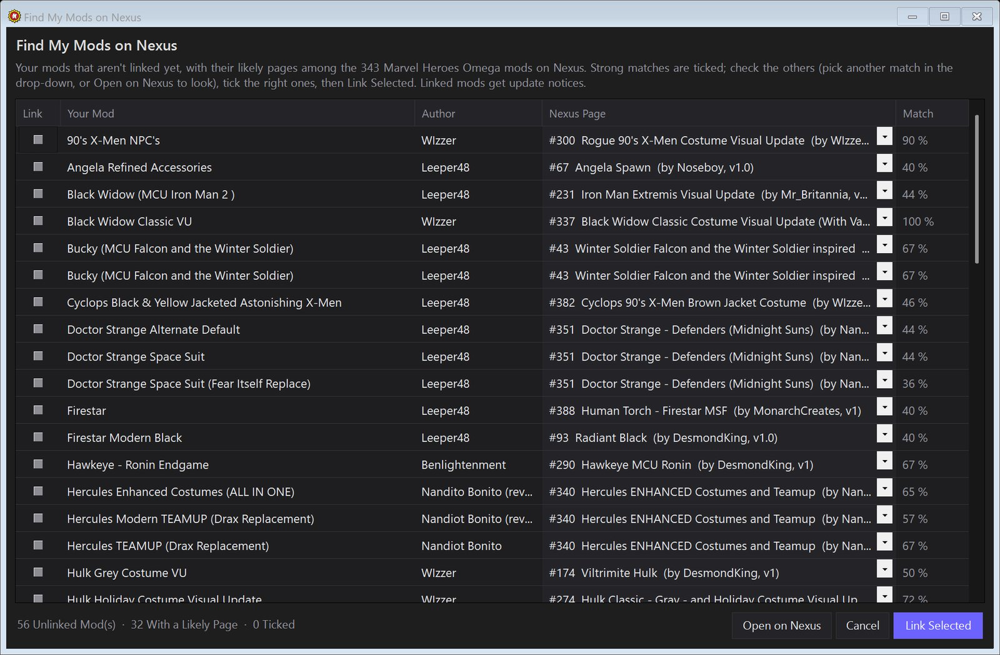
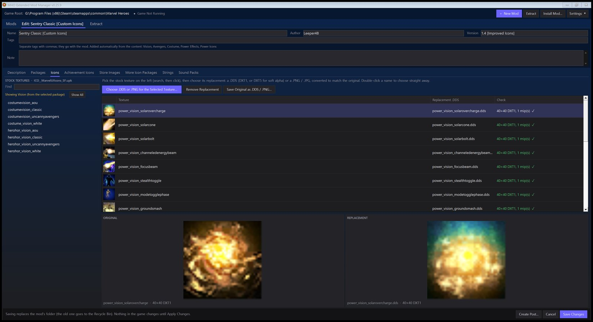
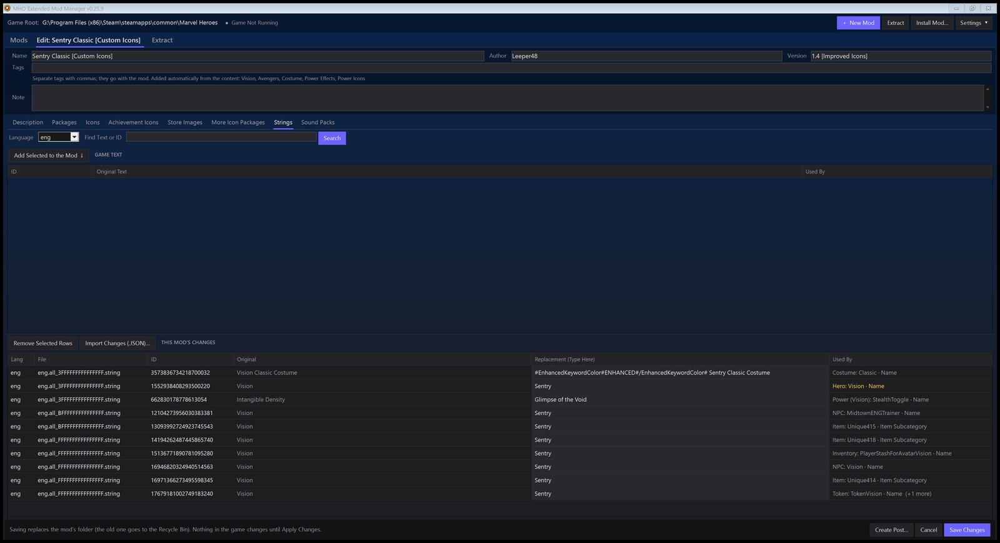

# MHO UPK Tools

Free, open-source Windows tools for modding **Marvel Heroes Omega**. The game is built on a customized Unreal Engine 3, and its content lives in `.upk` packages. These tools read and write those packages.

| Tool | What it's for | Status |
|---|---|---|
| [**MHO Extended Mod Manager**](#mho-extended-mod-manager) | Install, order and apply mods; make your own | Beta, [download](https://github.com/leeper48/MHO-UPK-Tools/releases/tag/extmm-v0.25.9) |
| [**MHO Package Modifier**](#mho-package-modifier) | Look inside packages; edit meshes, textures, zones and materials | In use; releases coming |
| [**AnimExportCli**](#animexportcli) | Export characters and animations to FBX | In development |

---

## MHO Extended Mod Manager

A mod manager for Marvel Heroes Omega. It does everything **MHModManager 1.0.1** does, in the same mod format, and adds a safety net, better organizing tools, an editor and Nexus Mods update checks. Mods it saves or exports still install in MHModManager 1.0.1.



### What it manages
- **Packages** (`.upk`): costumes, team-ups, NPCs, power effects, zones. The highest mod in the list wins where two change the same file.
- **Icons, achievement icons and store images**, rebuilt into the game's icon packages from clean originals. It also reaches **14 more icon packages** the old format can't.
- **Strings** (game text) in every game language.
- **Sound packs** (`.mhsfx`): new voice lines and sounds added to the game's sound banks.

### Safety
- **Verified originals:** every game file is rebuilt from a copy checked against a stock checksum list, never from a file another tool already changed. The list covers all 15,250 stock packages and was made from a clean install.
- **Checked writes with undo:** each file is built in a temporary copy, read back and verified, then swapped in, with an undo history.
- **Nothing left behind:** turning a mod off puts the original back. It also captures icon changes made by other tools, so Apply doesn't wipe them.
- **Game running:** it refuses to write while the game is running.

### Nexus Mods integration
- **Update checks:** add your personal Nexus API key, and mods with a newer version get a green **UPDATE** mark.
- **One-click updates for Premium members:** the update downloads and installs in place.
- **Free accounts:** the mod's Files page opens, and the app picks the file up from your Downloads folder.
- **Find My Mods:** matches your installed mods against the Marvel Heroes Omega mods on Nexus. Nothing is linked until you confirm.



### Editor (for mod makers)
- **One window with tabs:** description, packages, icons, achievement icons, store images, more icon packages, strings, sound packs.
- **Replacement images** as `.dds`, or as **PNG / JPG / BMP**, converted to the original's size and format automatically.
- **Strings:** search the game's strings, and see **what each one is used by** (a hero's name, an NPC, an item, a costume …).
- **Extract:** save the game's original images and strings as a starting point.
- **Create Post:** makes a Nexus description and a Discord message for your mod.





### Organizing
- **Tags:** automatic ones (character, team, costume, team-up, power effects, pet …), the mod's own tags, and your own.
- **Search, sort and group:** for example `tag:x-men`, `#costume`, `is:on`, `is:update`.
- **Priority:** move a mod to the top or bottom, and use **padlocks** to keep mods there.
- **Undo / redo** for list changes, and **notes** on each mod.
- **Mod cards** show hero portraits, and Ctrl+Enter applies changes.

### Get it
- **Download:** [latest Mod Manager release](https://github.com/leeper48/MHO-UPK-Tools/releases/tag/extmm-v0.25.9). **Setup.exe** installs for your user, with no admin rights needed; the **.zip** is portable. The app updates itself from here after asking.
- **Requirements:** Windows 10 or 11 (64-bit) and the [.NET 8 Desktop Runtime (x64)](https://dotnet.microsoft.com/download/dotnet/8.0).
- **First start:** it finds the game through Steam and offers to bring over your MHModManager library. The old manager's folder is never changed, so you can switch back at any time.

### Not code-signed
This is a hobby project, and its builds aren't signed with a paid certificate.
- **SmartScreen** may say "Windows protected your PC": click **More info**, then **Run anyway**.
- **Checking your download:** get it only from Nexus Mods or this repository's releases, then compare its SHA-256 with the `.sha256` file published next to it:

  ```powershell
  Get-FileHash .\MHO_Ext_ModManager-0.25.9-Setup.exe -Algorithm SHA256
  ```

- **How releases are built:** every release is built from this source by the [release workflow](.github/workflows/extmm-release.yml).

### Privacy
Nothing is sent anywhere unless you ask.
- **GitHub:** the update check contacts GitHub only after you agree to it.
- **Nexus:** it's contacted only when you use its features. Your API key is stored encrypted for your Windows user.

Source: [`MhoExtendedModManager/`](MhoExtendedModManager). The user guide ships as [`README.txt`](MhoExtendedModManager/README.txt).

---

## MHO Package Modifier

`MHO_UPK_Mod.exe`, a workbench for looking inside the game's packages and changing them:
- **Values:** browse any package's objects and change them: fog, colors, material parameters.
- **Textures:** view and replace them, including images streamed from the `.tfc` caches.
- **Meshes:** view them in 3D, export them to FBX and import edited ones back; changes are confirmed in-game.
- **Zones:** edit a zone's building placements in Blender (a round trip), copy materials and objects between packages, and rebuild a zone's distant view.

Every write makes a `.bak` of the original, is checked by a dry run first, and can be undone. The manual opens with F1.

Source: [`MhoPackageModifier/`](MhoPackageModifier). The user guide is [`Dist/README.txt`](MhoPackageModifier/Dist/README.txt).

## AnimExportCli

Exports skeletal meshes and animations to FBX (CLI and GUI). Importing FBX animations back into packages, including new bones, is in development.

Source: [`AnimExportCli/`](AnimExportCli).

---

## Building from source

- **Needs:** the .NET 8 SDK, on Windows.
- **Building:** each tool has a `build.bat` in its folder. MHO Extended Mod Manager references MHO Package Modifier, so build from a full checkout.

## Credits and license

- **Krisan:** MHO Extended Mod Manager builds on **MHModManager**, by Krisan: its mod format, its ideas and the mods made for it. Thank you.
- **Libraries:** [SharpCompress](https://github.com/adamhathcock/sharpcompress), ZstdSharp, System.IO.Hashing, AssimpNet and [assimp](https://github.com/assimp/assimp). See the `THIRD-PARTY-NOTICES.txt` files.
- **License:** [MIT](LICENSE).

Marvel Heroes Omega and Marvel characters are trademarks of their owners. This is an unofficial fan project, not affiliated with or endorsed by Marvel, Gazillion or Disney.
